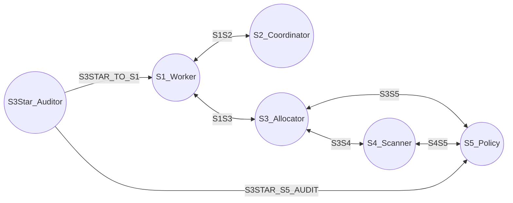
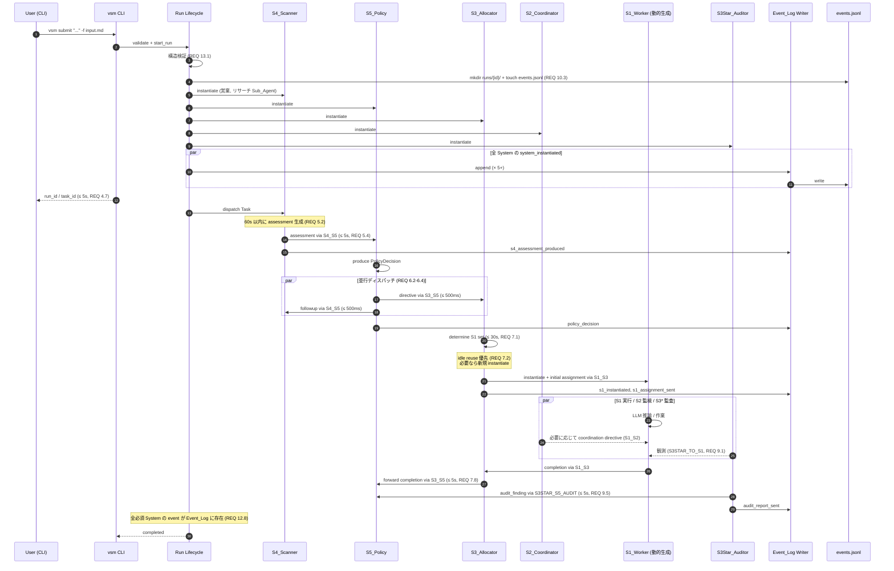
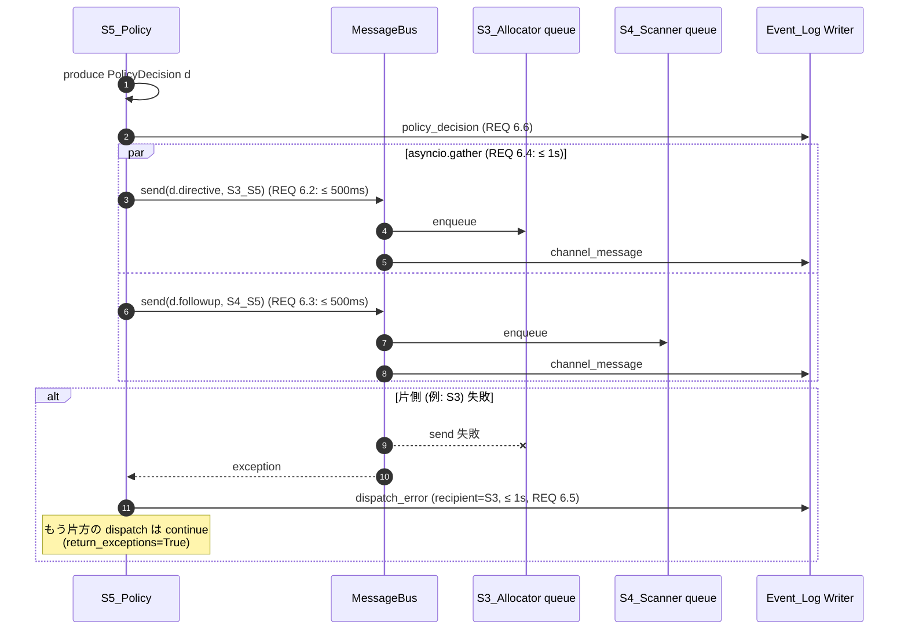
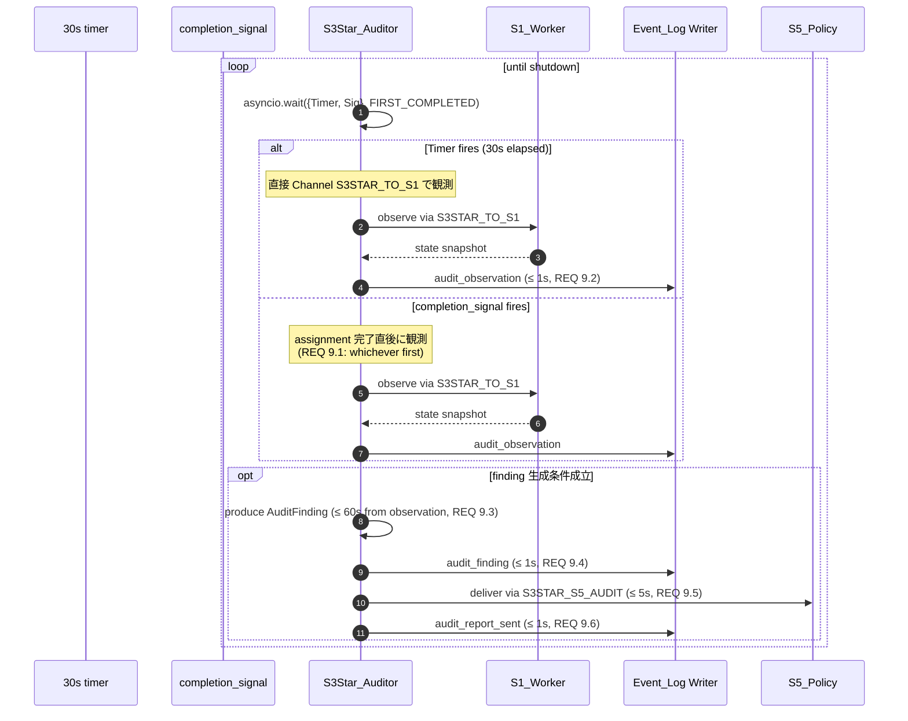
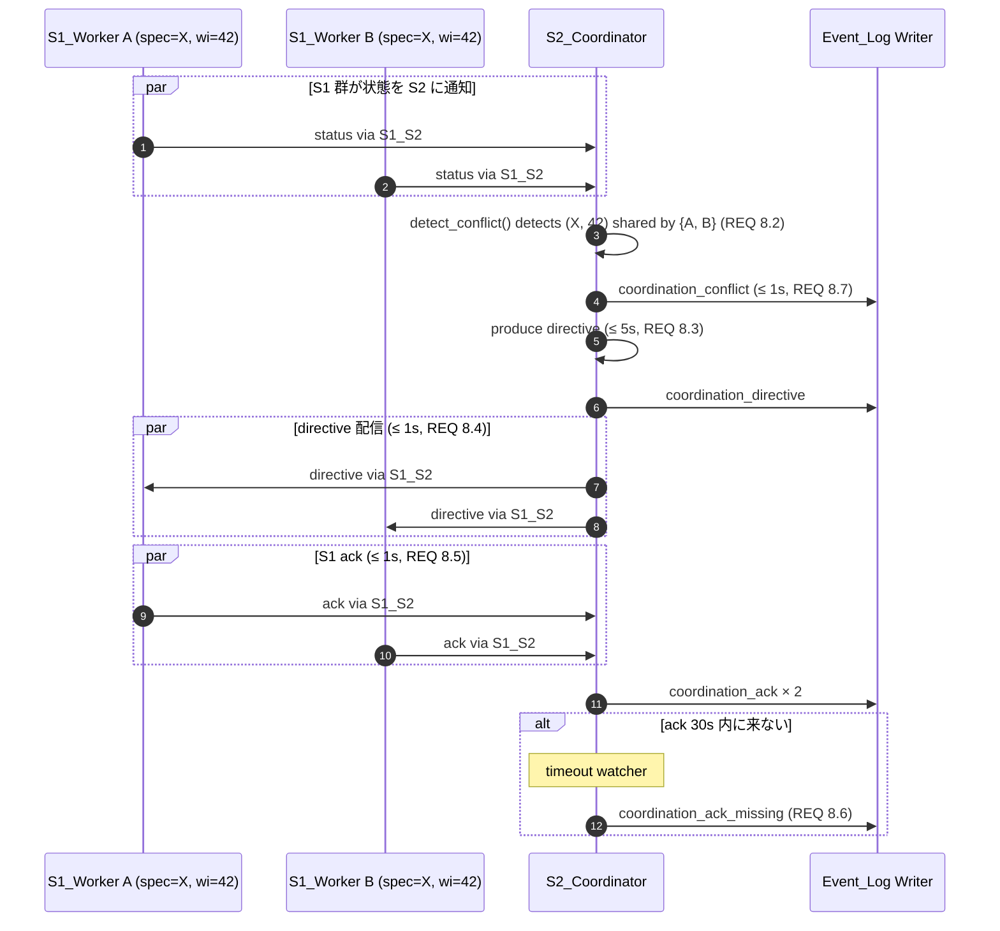
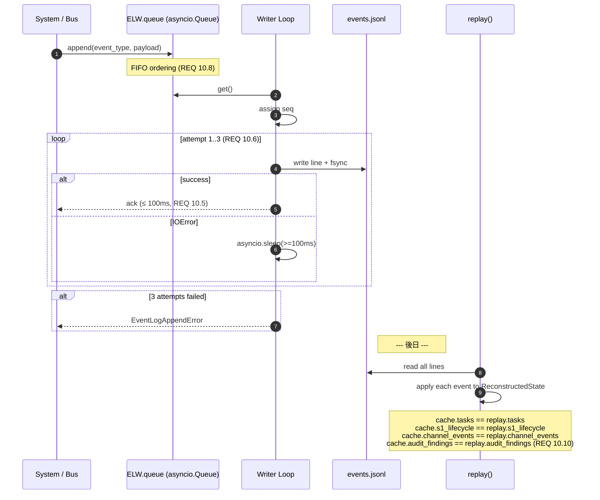
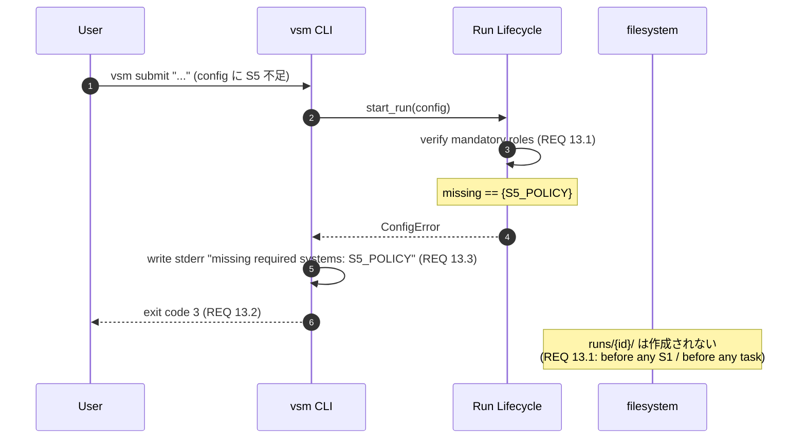

# Design Document

## Overview

`Nanihold OS` は、VSM (Viable System Model) の S1〜S5 および S3* を **動作する Python ソフトウェア** として実装するための基盤である。本設計は requirements.md の 14 個の Requirement を **トレース可能な単一プロセスの非同期アーキテクチャ** に落とし込む。

### 設計の中核方針

1. **単一プロセス + asyncio**: 全 System / Sub_Agent / Message_Bus / Event_Log writer / CLI 観測コマンドは単一の Python プロセス内で `asyncio` イベントループ上のコルーチンとして稼働する。LLM 呼び出しは I/O バウンドであり、500 ms オーダーの並行ディスパッチや 1 秒以内の配信要件は `asyncio.gather` / `asyncio.wait_for` を用いれば自然に表現できる。マルチスレッド / マルチプロセスは導入せず、競合状態の検証面積を最小化する。
2. **JSONL を Source of Truth**: 全状態変更は **「ランタイムキャッシュ更新の前または後ろではなく、専用 writer タスク経由で直列化された JSONL append」** を経由する。リプレイは同じ append 順を辿ることで cache を再構成できる (REQ 10)。
3. **Message_Bus のチャネル制約**: VSM が定義するチャネル以外の送信は **静的な許容テーブル** で拒否する (REQ 2.7)。許容テーブルは 6 本の標準チャネル (REQ 2.1〜2.6) に加えて、監査報告チャネル (REQ 9.5 / 12.6) を 7 本目として明示的に定義する。
4. **LLM の差し替え可能性**: `LiteLLM` を内部に持つ薄いラッパ `LLMProvider` を経由し、`LITELLM_PROVIDER` 環境変数または `vsm.toml` の `llm.provider` 設定で切り替える (REQ 3.7)。System / Sub_Agent コードはプロバイダー名を知らない。
5. **System / Sub_Agent の二層構造**: `System` は VSM 上の役割をラップする外殻、`Sub_Agent` は LLM プロンプトを実行する内側のユニットとして 2 階層に分離する (REQ 1.4, 3.2)。

### Requirement 〜 Design セクション 対応表

| Requirement | 主に反映するセクション |
|---|---|
| 1, 13 (VSM 構造制約) | Architecture / Components / Lifecycle |
| 2 (チャネル) | Components: Message_Bus / Data Models: Channel |
| 3 (LLM) | Components: LLM_Provider_Abstraction / Error Handling |
| 4 (CLI 投入) | Components: CLI / Data Models: Task |
| 5 (S4_Scanner) | Components: S4_Scanner / Sequence Diagrams |
| 6 (S5_Policy 並行ディスパッチ) | Components: S5_Policy / Sequence Diagrams |
| 7 (S3_Allocator + S1 動的生成) | Components: S3_Allocator / Data Models: S1_Worker_State |
| 8 (S2_Coordinator) | Components: S2_Coordinator / Data Models: Conflict |
| 9 (S3Star_Auditor) | Components: S3Star_Auditor |
| 10 (JSONL 永続化) | Components: Event_Log / Correctness Properties / Testing |
| 11 (CLI 観測) | Components: CLI |
| 12 (代表シナリオ) | Sequence Diagrams / Testing: Integration |
| 14 (スコープ外) | Components: CLI scope guard / README 連携 |

## Architecture

### 高レベル構成

```mermaid
flowchart TB
    subgraph Process["vsm Python Process (single asyncio event loop)"]
        CLI["CLI<br/>(Typer)"]
        Lifecycle["Run Lifecycle<br/>(Structural Verifier)"]
        State["Runtime State Cache<br/>(Tasks, S1 Pool)"]

        subgraph Systems["Systems (asyncio Tasks)"]
            S1["S1_Worker × N"]
            S2["S2_Coordinator"]
            S3["S3_Allocator"]
            S3Star["S3Star_Auditor"]
            S4["S4_Scanner"]
            S5["S5_Policy"]
        end

        Bus["Message_Bus<br/>(asyncio.Queue per endpoint)"]
        ELW["Event_Log Writer Task<br/>(single writer)"]
        LLM["LLM_Provider_Abstraction<br/>(LiteLLM wrapper)"]
    end

    CLI --> Lifecycle
    Lifecycle --> Systems
    Systems <--> Bus
    Systems --> ELW
    Bus --> ELW
    Systems --> LLM
    LLM --> ELW
    ELW -->|append| FS[("runs/{run_id}/events.jsonl")]
    State <-.replay.- FS
```

`asyncio.run` で起動する単一の `Platform` オブジェクトが上記要素を所有する。`Platform` の終了時は全 System を `cancel()` し、Event_Log writer を flush + close する。

### 並行モデル

| 種別 | 並行単位 | 担当 |
|---|---|---|
| 各 System | 1 つの `asyncio.Task` (メインループ) | 着信メッセージのディスパッチ |
| Sub_Agent 呼び出し | `asyncio.create_task` で短命タスク化 | LLM 呼び出し本体、`asyncio.wait_for(60s)` |
| Event_Log Writer | 単一の `asyncio.Task` | `asyncio.Queue` から取り出して直列に append |
| CLI 観測コマンド (`status`, `tail`, `replay`) | 別プロセスとして起動可能 (read-only) | Run プロセスとは独立した CLI プロセス |

> **設計判断:** マルチスレッドは採用しない。理由は (1) Python の GIL 下で CPU バウンドな処理は本 PoC に存在しない、(2) JSONL append のシリアライズが asyncio queue で自然に実現できる、(3) 全タイミング要件 (500 ms / 1 s / 5 s) は async I/O で十分達成できる、ため。

### Channel トポロジ

REQ 2.1〜2.6 の 6 本の標準チャネルに加え、REQ 9.5 / 12.6 で要求される **監査報告チャネル** を `S3STAR_S5_AUDIT` として 7 本目に位置付ける。これは S3* → S5 の単方向チャネルであり、REQ 2.7 の「定義されていないチャネル」には該当しない (定義済みチャネルとして許容テーブルに載る)。



### ディレクトリ・パッケージレイアウト

```
vsm/
├── __init__.py
├── cli.py                       # `vsm` エントリポイント (Typer)
├── config.py                    # vsm.toml / 環境変数ローダ
├── errors.py                    # 例外階層
├── ids.py                       # UUIDv4 / run_id バリデーション
├── clock.py                     # UTC clock 抽象 (テスト容易化)
├── platform.py                  # VSM_Platform オーケストレータ
├── messaging/
│   ├── __init__.py
│   ├── channels.py              # ChannelId enum + 許容テーブル
│   ├── message.py               # Message dataclass
│   └── bus.py                   # Message_Bus 本体
├── eventlog/
│   ├── __init__.py
│   ├── schema.py                # event_type ごとの payload schema
│   ├── writer.py                # 単一 writer タスク
│   ├── reader.py                # tail / status 用 reader
│   └── replay.py                # リプレイによる State 再構成
├── llm/
│   ├── __init__.py
│   ├── provider.py              # LLMProvider (LiteLLM ラッパ)
│   └── types.py                 # LLMRequest / LLMResponse
├── systems/
│   ├── __init__.py
│   ├── base.py                  # System / Sub_Agent 基底クラス
│   ├── s1_worker.py
│   ├── s2_coordinator.py
│   ├── s3_allocator.py
│   ├── s3star_auditor.py
│   ├── s4_scanner.py
│   └── s5_policy.py
├── runtime/
│   ├── __init__.py
│   ├── lifecycle.py             # 構造検証 / Run 開始終了
│   └── state.py                 # ランタイムキャッシュ (Tasks, S1 pool)
└── tests/
    ├── unit/
    ├── property/
    └── integration/
runs/                            # 実行時生成 (Source of Truth)
└── {run_id}/events.jsonl
```


## Components and Interfaces

### 1. System / Sub_Agent 基底クラス

```python
# vsm/systems/base.py
class SubAgent:
    sub_agent_id: str            # UUIDv4
    label: str                   # "営業", "リサーチ", "default" 等
    system_id: str               # 親 System の id

    async def respond(self, prompt: str, context: dict) -> str:
        """LLM_Provider_Abstraction を介して LLM 応答を返す。
        60 秒タイムアウトと Event_Log への記録は本メソッド内で完結する。"""

class System:
    system_id: str               # UUIDv4
    role: SystemRole             # Enum: S1_WORKER, S2_COORDINATOR, ...
    sub_agents: list[SubAgent]   # 1 ≤ len ≤ 64 (REQ 1.4)
    _bus: MessageBus
    _eventlog: EventLogWriter

    async def run(self) -> None:
        """着信メッセージをディスパッチし、System ごとの責務に従って処理。
        各サブクラスが override する。"""

    async def shutdown(self) -> None: ...
```

`SystemRole` は Enum で `S1_WORKER`, `S2_COORDINATOR`, `S3_ALLOCATOR`, `S3STAR_AUDITOR`, `S4_SCANNER`, `S5_POLICY` を定義する (REQ 1.1)。

#### Sub_Agent 登録とタイムアウト (REQ 3.4 / 3.5 / 5.5)

`SubAgent.respond` は以下の擬似コードで保護される:

```python
async def respond(self, prompt, context):
    started = clock.now()
    try:
        result = await asyncio.wait_for(
            self._llm.invoke(prompt, model=context.get("model")),
            timeout=60.0,
        )
    except asyncio.TimeoutError:
        elapsed = clock.now() - started
        await self._eventlog.append("llm_timeout", {
            "system_id": self.system_id,
            "sub_agent_id": self.sub_agent_id,
            "elapsed_ms": int(elapsed.total_seconds() * 1000),
        })
        raise LLMTimeoutError(self.sub_agent_id, elapsed)
    except LLMProviderError as e:
        await self._eventlog.append("llm_error", {...})
        raise
    await self._eventlog.append("llm_invocation", {...})
    return result
```

REQ 3.5 の「キャンセル後 1 秒以内のエラー伝達」は、`asyncio.wait_for` のキャンセル後に同じイベントループ内で例外を伝播させるため、構造的に 1 秒以内に達成可能である。

### 2. Message_Bus

#### チャネル定義 (REQ 2.1〜2.6, 9.5)

```python
# vsm/messaging/channels.py
class ChannelId(Enum):
    S1_S2 = "S1-S2"
    S1_S3 = "S1-S3"
    S3_S4 = "S3-S4"
    S3_S5 = "S3-S5"
    S4_S5 = "S4-S5"
    S3STAR_TO_S1 = "S3*->S1"               # 単方向 (REQ 2.6)
    S3STAR_S5_AUDIT = "S3*->S5(audit)"     # 単方向 (REQ 9.5, 12.6)

# (sender_role, receiver_role, channel) -> 許容性
ALLOWED_ROUTES: frozenset[tuple[SystemRole, SystemRole, ChannelId]] = frozenset({
    (S1_WORKER,       S2_COORDINATOR,  S1_S2),
    (S2_COORDINATOR,  S1_WORKER,       S1_S2),
    (S1_WORKER,       S3_ALLOCATOR,    S1_S3),
    (S3_ALLOCATOR,    S1_WORKER,       S1_S3),
    (S3_ALLOCATOR,    S4_SCANNER,      S3_S4),
    (S4_SCANNER,      S3_ALLOCATOR,    S3_S4),
    (S3_ALLOCATOR,    S5_POLICY,       S3_S5),
    (S5_POLICY,       S3_ALLOCATOR,    S3_S5),
    (S4_SCANNER,      S5_POLICY,       S4_S5),
    (S5_POLICY,       S4_SCANNER,      S4_S5),
    (S3STAR_AUDITOR,  S1_WORKER,       S3STAR_TO_S1),
    (S3STAR_AUDITOR,  S5_POLICY,       S3STAR_S5_AUDIT),
})
```

> **設計判断:** S3* → S1 経路は **S3_Allocator を経由しない** ことが REQ 9.1 で明示されているため、`Message_Bus` は `S3STAR_TO_S1` を S3* と S1 専用の独立キューとして実装し、S3_Allocator のキューには絶対に届かないことをコード構造で保証する。

#### Message_Bus API

```python
# vsm/messaging/bus.py
@dataclass(frozen=True)
class Message:
    message_id: str              # UUIDv4
    sender: tuple[SystemRole, str]      # (role, system_id)
    receiver: tuple[SystemRole, str]    # (role, system_id)
    channel: ChannelId
    payload: dict
    timestamp_ms: int            # ms 精度 (REQ 2.8, 2.9)

class MessageBus:
    async def send(self, msg: Message) -> SendResult:
        """REQ 2.7: ALLOWED_ROUTES に存在しない経路は ChannelRejected を返す。
        REQ 2.8: rejection も Event_Log に記録。
        REQ 2.9: 配信成功時も Event_Log に記録。"""

    def subscribe(self, system_id: str, channel: ChannelId) -> asyncio.Queue[Message]:
        """System の起動時に呼び、自身宛のメッセージを受け取るキューを取得する。"""
```

#### 配信レイテンシ (REQ 2.9 / 1 秒以内)

`MessageBus.send` は以下を **同一イベントループ tick 内** で完了させる:

1. ルート許容チェック (in-memory `frozenset` の O(1) lookup)
2. 受信側 `asyncio.Queue.put_nowait`
3. Event_Log writer の queue に append タスクを `put_nowait`

ローカルの asyncio.Queue は遅延が ms オーダーであるため、配信〜Event_Log append の合計は 1 秒以内に十分収まる。`put_nowait` を使用して back-pressure を発生させないことで、キュー容量超過時は即時例外として顕在化させる。

### 3. Event_Log Writer / Reader / Replay

#### 共通スキーマ

全 JSONL レコードは以下のキーを必須で持つ (REQ 10.7):

```json
{
  "ts": "2025-01-15T03:14:15.926Z",
  "run_id": "run-abc...",
  "event_type": "channel_message",
  "seq": 42,
  "payload": { ... }
}
```

- `ts`: UTC ISO 8601 with millisecond precision
- `run_id`: REQ 10.2 の制約に従う (1〜64 ASCII 文字)
- `event_type`: 以下 §Data Models で列挙
- `seq`: writer が単調増加で付与 (REQ 10.8 の FIFO 保証 + replay の安定ソート鍵)
- `payload`: event_type ごとに schema が異なる

#### 単一 writer による直列化 (REQ 10.5 / 10.6 / 10.8)

```python
# vsm/eventlog/writer.py
class EventLogWriter:
    def __init__(self, path: Path):
        self._path = path
        self._queue: asyncio.Queue[Event] = asyncio.Queue()
        self._seq = 0
        self._fh = path.open("a", encoding="utf-8", buffering=1)  # line buffered

    async def append(self, event_type: str, payload: dict) -> None:
        evt = Event(
            ts=clock.now_iso(),
            run_id=self._run_id,
            event_type=event_type,
            seq=-1,                # writer が確定させる
            payload=payload,
        )
        await self._queue.put(evt)
        # caller は returned future を await することで「100 ms 以内 append 完了」を確認できる

    async def _writer_loop(self):
        while True:
            evt = await self._queue.get()
            evt.seq = self._seq
            self._seq += 1
            await self._write_with_retry(evt)

    async def _write_with_retry(self, evt: Event):
        for attempt in range(3):    # REQ 10.6: 最大 3 回
            try:
                line = json.dumps(asdict(evt), ensure_ascii=False, separators=(",", ":"))
                self._fh.write(line + "\n")
                self._fh.flush()
                os.fsync(self._fh.fileno())     # 100 ms 以内 (REQ 10.5) のため fsync
                return
            except OSError as e:
                if attempt == 2:
                    raise EventLogAppendError(evt, e)
                await asyncio.sleep(0.1)        # REQ 10.6: 100 ms 以上の間隔
```

> **設計判断:** `os.fsync` を毎 append で呼ぶことで耐障害性を確保する。代表シナリオが 1800 秒で数百〜数千 event 程度であり、fsync コストは要件達成の妨げにならない。スループットが問題化したら後続イテレーションでバッチ fsync に切り替える。

#### tail (REQ 11.2 / 11.3)

`vsm tail` は別プロセスで以下を行う:

```python
async def tail(run_id: str, system_filters: list[str], channel_filters: list[str]):
    path = Path(f"runs/{run_id}/events.jsonl")
    if not path.exists():
        # REQ 11.7
        print(f"Event_Log not found for run {run_id}", file=sys.stderr)
        sys.exit(2)
    with path.open("r", encoding="utf-8") as fh:
        # 既存内容を読み切ってから追従
        for line in fh:
            emit_if_matches(line, system_filters, channel_filters)
        while True:
            line = fh.readline()
            if not line:
                await asyncio.sleep(0.2)        # REQ 11.2: 1 秒以内に追従
                continue
            emit_if_matches(line, system_filters, channel_filters)
```

`emit_if_matches` は `system_filters` (OR) と `channel_filters` (OR) を AND で結合して評価する (REQ 11.3 / 11.4)。

#### replay (REQ 10.10 / 11.5 / 11.6)

```python
# vsm/eventlog/replay.py
def replay(path: Path) -> ReconstructedState:
    state = ReconstructedState()
    with path.open("r") as fh:
        for line in fh:
            evt = json.loads(line)
            state.apply(evt)        # event_type ごとの handler
    return state

@dataclass
class ReconstructedState:
    tasks: dict[str, TaskState]              # REQ 10.10
    s1_lifecycle: dict[str, list[S1Event]]   # REQ 10.10
    channel_events: list[ChannelEvent]       # REQ 10.10
    audit_findings: dict[str, AuditFinding]  # REQ 10.10
```

`vsm replay` サブコマンドは Run が active かどうかを `runs/{run_id}/RUNNING` lockfile の有無で判別し、active であれば stderr に警告を出してから読み取りを行う (REQ 11.6)。

### 4. LLM_Provider_Abstraction

```python
# vsm/llm/provider.py
class LLMProvider:
    def __init__(self, config: LLMConfig):
        # 環境変数 LITELLM_PROVIDER > config ファイル > エラー の優先順 (REQ 3.7)
        self._model = config.resolve_model()

    async def invoke(self, prompt: str, model: str | None = None) -> LLMResponse:
        try:
            resp = await litellm.acompletion(
                model=model or self._model,
                messages=[{"role": "user", "content": prompt}],
                timeout=60,                  # SDK レベルでも保護
            )
        except litellm.exceptions.APIError as e:
            raise LLMProviderError(code=e.status_code, message=str(e)) from e
        return LLMResponse(
            text=resp.choices[0].message.content,
            tokens_in=resp.usage.prompt_tokens,
            tokens_out=resp.usage.completion_tokens,
            latency_ms=int(resp._response_ms),
        )
```

タイムアウトは `asyncio.wait_for(invoke(), 60)` で **アプリ側でも** ラップする (二重防衛)。プロバイダー差し替えは `LLMConfig.resolve_model` がモデル名 (例: `openai/gpt-4o-mini`, `anthropic/claude-3-5-sonnet`, `bedrock/anthropic.claude-3-haiku-...`) を返すだけで完結し、System / Sub_Agent コードは変更不要 (REQ 3.7)。

### 5. CLI

`Typer` を採用する。サブコマンドは `submit` (タスク投入), `status`, `tail`, `replay`。

```python
# vsm/cli.py
app = typer.Typer()

@app.command()
def submit(
    description: str = typer.Argument(..., help="1〜8192 ASCII 文字"),
    file: list[Path] = typer.Option(default_factory=list, "--file", "-f"),
):
    """REQ 4.1〜4.7"""
    if not (1 <= len(description) <= 8192) or not description.isascii():
        typer.echo(f"description length out of range [1, 8192]", err=True)
        raise typer.Exit(code=2)
    ctx_files = []
    for p in file:
        if not p.exists() or p.stat().st_size > 1_048_576:
            typer.echo(f"file {p} not found or > 1 MB", err=True)
            raise typer.Exit(code=2)
        try:
            ctx_files.append((str(p), p.read_text(encoding="utf-8")))
        except UnicodeDecodeError:
            typer.echo(f"file {p} not valid UTF-8", err=True)
            raise typer.Exit(code=2)
    run_id, task_id = asyncio.run(Platform.submit(description, ctx_files))
    typer.echo(f"run_id={run_id}\ntask_id={task_id}")     # REQ 4.7

@app.command()
def status(run_id: str): ...
@app.command()
def tail(run_id: str, system: list[str] = ..., channel: list[str] = ...): ...
@app.command()
def replay(run_id: str): ...
```

`vsm status` は Event_Log を replay して現在の Tasks と System を出力する (REQ 11.1)。完了 `Run` でも active `Run` でも、Event_Log が真実なので同じ実装で動く。

### 6. 各 System の責務

#### S1_Worker (`vsm/systems/s1_worker.py`)

- **入力チャネル**: `S1_S3` (S3 からの assignment), `S1_S2` (S2 からの調整指示), `S3STAR_TO_S1` (監査要求)
- **出力チャネル**: `S1_S3` (完了/失敗報告), `S1_S2` (調整 ack)
- **状態**: `specialization`, `current_assignments: list[work_item_id]`
- **動作**:
  1. `S1_S3` で assignment を受信 → `current_assignments` に追加 → Sub_Agent (LLM) で実行 → 完了時 `S1_S3` で完了報告
  2. `S1_S2` で coordination directive 受信 → 1 秒以内に ack 返送 (REQ 8.5)
  3. `S3STAR_TO_S1` で観測要求受信 → 現状態を返送

#### S2_Coordinator (`vsm/systems/s2_coordinator.py`)

- 全 S1_Worker の状態を `S1_S2` 経由で監視
- conflict 検出ロジック (REQ 8.2):
  ```python
  def detect_conflict(s1_states: dict[str, S1State]) -> list[Conflict]:
      groups = defaultdict(list)
      for s1 in s1_states.values():
          for wi in s1.current_assignments:
              groups[(s1.specialization, wi)].append(s1.id)
      return [Conflict(spec=k[0], work_item=k[1], s1_ids=v)
              for k, v in groups.items() if len(v) >= 2]
  ```
- conflict 検出から directive 生成まで 5 秒以内 (REQ 8.3)、配信は 1 秒以内 (REQ 8.4)
- ack 不達は 30 秒で `coordination_ack_missing` イベント (REQ 8.6)

#### S3_Allocator (`vsm/systems/s3_allocator.py`)

- **S1 プール管理**:
  ```python
  @dataclass
  class S1Pool:
      workers: dict[str, S1Worker]    # id -> instance
      def find_idle(self, spec: str) -> S1Worker | None:
          for w in self.workers.values():
              if w.specialization == spec and len(w.current_assignments) == 0:
                  return w
          return None
  ```
- **directive 受信フロー** (REQ 7.1〜7.7):
  1. S5 から directive 受信 (S3_S5)
  2. LLM Sub_Agent で「必要 specialization と count」を JSON 出力
  3. 各 specialization につき `find_idle` を呼び reuse 優先 (REQ 7.2)
  4. なければ新規 S1 を最大 64 個まで instantiate (REQ 13.6)、5 秒以内に最初の assignment を渡す (REQ 7.3)
  5. assignment 送信 (S1_S3) を 1 秒以内に完了 (REQ 7.6)
  6. instantiation 失敗時は `s1_instantiation_error` を append し、5 秒以内に S5 へ通知 (REQ 7.5)

#### S3Star_Auditor (`vsm/systems/s3star_auditor.py`)

- **観測スケジューラ**: 30 秒タイマと「assignment 完了通知」のいずれか早い方で発火 (REQ 9.1)
  ```python
  async def loop(self):
      while True:
          done, pending = await asyncio.wait(
              {asyncio.create_task(asyncio.sleep(30)),
               asyncio.create_task(self._completion_signal.wait())},
              return_when=asyncio.FIRST_COMPLETED,
          )
          for t in pending: t.cancel()
          await self._observe_all_s1()
  ```
  > **重要:** 観測要求は `S3STAR_TO_S1` を通り、S3_Allocator を経由しない (REQ 9.1)。
- 観測ごとに `audit_observation`、finding 生成時に `audit_finding`、S5 配送時に `audit_report_sent` を append (REQ 9.2 / 9.4 / 9.6)

#### S4_Scanner (`vsm/systems/s4_scanner.py`)

- 必須 Sub_Agent: `営業`, `リサーチ` (Run start 前に登録, REQ 5.1)
- assessment 生成 60 秒以内 (REQ 5.2)、S5 配送 5 秒以内 (REQ 5.4)
- Sub_Agent 個別タイムアウト 30 秒 (REQ 5.5): `asyncio.wait_for(sub.respond(...), 30)` で保護し、TimeoutError は他 Sub_Agent の結果を採用して継続
- 配送失敗時 3 回まで 10 秒間隔でリトライ (REQ 5.6)

#### S5_Policy (`vsm/systems/s5_policy.py`)

- **並行ディスパッチ** (REQ 6.2 / 6.3 / 6.4):
  ```python
  async def dispatch_decision(self, decision: PolicyDecision):
      to_s3 = self._bus.send(Message(... channel=S3_S5, payload=decision.directive))
      to_s4 = self._bus.send(Message(... channel=S4_S5, payload=decision.followup))
      results = await asyncio.gather(to_s3, to_s4, return_exceptions=True)
      for recipient, r in zip(("S3", "S4"), results):
          if isinstance(r, Exception):
              await self._eventlog.append("dispatch_error", {
                  "recipient": recipient, "reason": str(r),
              })
  ```
  `asyncio.gather` で並行発行することで、片側 500 ms × 2 を逐次実行した場合の 1 秒超過を回避し、また `return_exceptions=True` で **片側失敗が他方をブロックしない** ことを構造的に保証する (REQ 6.5)。

### 7. Run Lifecycle / 構造制約検証

```python
# vsm/runtime/lifecycle.py
async def start_run(config: RunConfig) -> str:
    # REQ 13.1: 構造検証
    missing = []
    for role in (S2_COORDINATOR, S3_ALLOCATOR, S3STAR_AUDITOR, S4_SCANNER, S5_POLICY):
        if config.systems_for(role) < 1:
            missing.append(role.name)
    if missing:
        # REQ 13.2 / 13.3
        print(f"missing required systems: {', '.join(missing)}", file=sys.stderr)
        sys.exit(3)

    # REQ 10.3: ディレクトリ + ファイル作成
    run_id = generate_run_id()
    run_dir = Path(f"runs/{run_id}")
    try:
        run_dir.mkdir(parents=True, exist_ok=False)
        (run_dir / "events.jsonl").touch()
    except OSError as e:
        # REQ 10.4
        print(f"failed to create {run_dir}: {e}", file=sys.stderr)
        sys.exit(4)

    # REQ 1.5: 5 秒以内に instantiation の Event_Log entry を全 System ぶん発行
    platform = Platform(run_id, config)
    await platform.instantiate_systems()
    return run_id
```


## Data Models

### Event スキーマ (event_type 一覧)

全 event は §Event_Log Writer の共通スキーマ (`ts`, `run_id`, `event_type`, `seq`, `payload`) を持つ。`payload` の構造は以下の通り。本 PoC では `pydantic` モデルとして定義し、append 時に validation を行う。

| event_type | 発行箇所 | payload 主要フィールド | 出典要件 |
|---|---|---|---|
| `system_instantiated` | Run start 時 / S1 動的生成時 | `system_id`, `role`, `sub_agent_count` | REQ 1.5, 1.6 |
| `system_instantiation_failed` | 必須 System 起動失敗 | `role`, `reason` | REQ 1.7, 13.2 |
| `task_submitted` | CLI submit | `task_id`, `run_id`, `description`, `file_paths`, `submitted_at` | REQ 4.6 |
| `task_state_changed` | Task 状態遷移 | `task_id`, `from_state`, `to_state` | REQ 10.5 |
| `channel_message` | 配信成功 | `sender`, `receiver`, `channel`, `payload` | REQ 2.9 |
| `channel_rejected` | 未定義チャネル拒否 | `sender`, `receiver`, `channel` | REQ 2.7, 2.8 |
| `llm_invocation` | LLM 応答受領 | `system_id`, `sub_agent_id`, `model`, `prompt`, `response`, `latency_ms`, `tokens_in`, `tokens_out` | REQ 3.3 |
| `llm_timeout` | 60 秒超 | `system_id`, `sub_agent_id`, `elapsed_ms` | REQ 3.5 |
| `llm_error` | プロバイダーエラー | `system_id`, `sub_agent_id`, `provider_code`, `provider_message` | REQ 3.6 |
| `s4_assessment_produced` | S4 assessment 完成 | `assessment_id`, `opportunities`, `threats` | REQ 5.2, 5.3 |
| `sub_agent_error` | Sub_Agent 30 秒超 | `sub_agent_id`, `elapsed_ms`, `reason` | REQ 5.5 |
| `delivery_error` | 配送失敗 | `attempt`, `channel`, `reason` | REQ 5.6 |
| `policy_decision` | S5 決定発行 | `decision_id`, `assessment_id`, `directive`, `followup_request` | REQ 6.6 |
| `dispatch_error` | S5 並行ディスパッチ片側失敗 | `recipient`, `channel`, `reason` | REQ 6.5 |
| `s1_instantiated` | S3 が S1 新規作成 | `s1_id`, `specialization`, `initial_assignment` | REQ 7.4 |
| `s1_instantiation_error` | S1 作成失敗 | `specialization`, `reason` | REQ 7.5 |
| `s1_assignment_sent` | S3 → S1 assignment | `s1_id`, `work_item_id`, `assignment` | REQ 7.7 |
| `s1_completion` | S1 完了報告 | `s1_id`, `work_item_id`, `result` | REQ 7.8, 12.4 |
| `coordination_conflict` | S2 conflict 検出 | `specialization`, `work_item_id`, `s1_ids` | REQ 8.7 |
| `coordination_directive` | S2 directive 発行 | `directive_id`, `affected_s1_ids`, `directive` | REQ 8.7 |
| `coordination_ack` | S1 → S2 ack | `directive_id`, `s1_id` | REQ 8.7 |
| `coordination_ack_missing` | ack 30 秒タイムアウト | `directive_id`, `s1_id`, `elapsed_ms` | REQ 8.6 |
| `audit_observation` | S3* 観測 | `s1_id`, `observed_state` | REQ 9.2 |
| `audit_finding` | S3* finding 生成 | `finding_id`, `s1_id`, `content` | REQ 9.4 |
| `audit_report_sent` | S3* → S5 配送 | `finding_id` | REQ 9.6 |
| `event_log_append_error` | append 失敗 (3 回失敗後) | `target_event_type`, `attempts`, `reason` | REQ 10.6 |

### Channel メッセージスキーマ

```python
@dataclass(frozen=True)
class Message:
    message_id: str           # UUIDv4
    sender_role: SystemRole
    sender_id: str
    receiver_role: SystemRole
    receiver_id: str
    channel: ChannelId
    payload: dict             # 各 System が定義する内部スキーマ
    timestamp_ms: int         # ms 精度 (REQ 2.8, 2.9)
```

### Task / Run

```python
class TaskState(Enum):
    SUBMITTED = "submitted"
    SCANNING = "scanning"            # S4 が処理中
    POLICY_PRODUCED = "policy_produced"
    ALLOCATING = "allocating"        # S3 が S1 配分中
    EXECUTING = "executing"          # S1 群が実行中
    COMPLETED = "completed"
    FAILED = "failed"

@dataclass
class Task:
    task_id: str                     # UUIDv4
    run_id: str                      # 1〜64 ASCII chars (REQ 10.2)
    description: str                 # 1〜8192 ASCII chars (REQ 4.1)
    context_files: list[tuple[str, str]]   # (path, contents)
    state: TaskState
    submitted_at: datetime           # UTC

@dataclass
class Run:
    run_id: str
    started_at: datetime
    state: Literal["initializing", "active", "failed", "completed"]
    tasks: dict[str, Task]
```

### S1_Worker State

```python
@dataclass
class S1State:
    s1_id: str
    specialization: str              # 例: "frontend", "test", "backend"
    current_assignments: list[str]   # work_item_id のリスト
    sub_agents: list[SubAgent]
    created_at: datetime
    terminated_at: datetime | None
```

`S3_Allocator.find_idle(spec)` は `len(current_assignments) == 0 and specialization == spec` を満たす最初の `S1State` を返す (REQ 7.2 の idle 定義)。

### Conflict / Coordination Directive

```python
@dataclass(frozen=True)
class Conflict:
    specialization: str
    work_item_id: str
    s1_ids: tuple[str, ...]          # |s1_ids| >= 2 (REQ 8.2)

@dataclass(frozen=True)
class CoordinationDirective:
    directive_id: str
    conflict: Conflict
    instructions: dict               # 例: {"primary_s1_id": "...", "yield_s1_ids": [...]}
```

### Audit Finding / Environment Assessment / Policy Decision

```python
@dataclass
class EnvironmentAssessment:
    assessment_id: str
    opportunities: list[Item]        # |description| >= 1 (REQ 5.3)
    threats: list[Item]
    produced_at: datetime

@dataclass
class Item:
    item_id: str
    description: str                 # >= 1 char

@dataclass
class PolicyDecision:
    decision_id: str
    assessment_id: str
    directive: dict                  # to S3
    followup_request: dict           # to S4

@dataclass
class AuditFinding:
    finding_id: str
    s1_id: str
    content: dict
    produced_at: datetime
```


## Correctness Properties

*A property is a characteristic or behavior that should hold true across all valid executions of a system — essentially, a formal statement about what the system should do. Properties serve as the bridge between human-readable specifications and machine-verifiable correctness guarantees.*

### Why PBT applies to this feature

本 PoC は **メッセージング基盤・JSONL 永続化・S1 プール管理・conflict 検出** を中核に持ち、これらはすべて純粋な関数または mockable な I/O ラッパとして実装される。各層には「任意の入力 / 状態に対する不変条件」が複数存在し (チャネル許容性、reuse 優先、replay ラウンドトリップ、FIFO 順、conflict 検出ロジック、SLA 内 append 等)、property-based testing が高い ROI を発揮する。

LLM 呼び出しの実体や代表シナリオの E2E 動作はそれぞれ INTEGRATION / SMOKE 相当のため、これらは property test ではなく integration test で扱う (§Testing Strategy)。

### Property 1: Channel rejection invariant

*For any* tuple `(sender_role, sender_id, receiver_role, receiver_id, channel, payload)` where `(sender_role, receiver_role, channel) ∉ ALLOWED_ROUTES`, when sent via `MessageBus.send`, the call SHALL return a `ChannelRejected` indication, the receiver's subscription queue SHALL NOT contain the message, and exactly one `channel_rejected` event SHALL be appended to the Event_Log within 100 ms, containing `sender_id`, `receiver_id`, `channel`, and a millisecond-precision timestamp.

**Validates: Requirements 2.7, 2.8**

### Property 2: Channel delivery invariant

*For any* tuple `(sender_role, sender_id, receiver_role, receiver_id, channel, payload)` where `(sender_role, receiver_role, channel) ∈ ALLOWED_ROUTES`, when sent via `MessageBus.send`, the receiver's subscription queue SHALL contain exactly one message equal to the input, and exactly one `channel_message` event SHALL be appended to the Event_Log within 1 second containing `sender_id`, `receiver_id`, `channel`, `payload`, and a millisecond-precision timestamp.

**Validates: Requirements 2.1, 2.2, 2.3, 2.4, 2.5, 2.6, 2.9**

### Property 3: Event SLA conformance

*For any* runtime occurrence `o` of one of the SLA-bounded event types listed below, the Event_Log entry that records `o` SHALL be appended within the SLA defined by the corresponding requirement, where the SLA mapping is:

| occurrence | event_type | SLA |
|---|---|---|
| System instantiated at Run start | `system_instantiated` | 5 s |
| Dynamically created S1_Worker | `s1_instantiated` | 5 s (REQ 1.6) and 1 s (REQ 7.4) |
| Task accepted by CLI | `task_submitted` | 1 s |
| Channel message sent / received | `channel_message` | 100 ms (REQ 10.5) and within 1 s for delivery (REQ 2.9) |
| LLM response received | `llm_invocation` | 1 s |
| S4 assessment delivered to S5 | `channel_message` on S4_S5 | 5 s |
| S5 dispatch errors | `dispatch_error` | 1 s |
| S5 policy decision produced | `policy_decision` | 1 s |
| S3 assignment sent | `s1_assignment_sent` | 1 s |
| S2 conflict / directive / ack | `coordination_*` | 1 s |
| S3* observation / finding / report | `audit_*` | 1 s |
| Any state change above | append to events.jsonl | 100 ms (REQ 10.5) |

**Validates: Requirements 1.5, 1.6, 2.9, 3.3, 4.6, 5.4, 6.5, 6.6, 7.4, 7.7, 8.7, 9.2, 9.4, 9.6, 10.5**

### Property 4: Latency-bounded operation invariant

*For any* operation listed below executed under any valid initial state and input, the elapsed wall-clock time between the triggering event and the operation's completion SHALL not exceed the corresponding SLA:

| operation | trigger | SLA |
|---|---|---|
| LLM invocation timeout | invocation start | 60 s (cancel within 1 s after) |
| LLM error / timeout typed-error delivery | provider error or timeout | 1 s |
| S4 assessment production | dispatch arrival | 60 s |
| S4 followup assessment | followup request arrival | 60 s |
| S4 sub_agent timeout fallback | sub_agent invocation start | 30 s |
| S5 directive dispatch to S3 | policy decision produced | 500 ms |
| S5 followup dispatch to S4 | policy decision produced | 500 ms |
| S5 both dispatches complete | policy decision produced | 1 s |
| S3 determine S1 set | directive arrival | 30 s |
| S3 instantiate new S1 | determination | 5 s |
| S3 assignment send | assignment decision | 1 s |
| S3 forward S1 completion to S5 | S1 completion arrival | 5 s |
| S2 directive production | conflict detection | 5 s |
| S2 directive delivery | directive production | 1 s |
| S1 ack to coordination directive | directive receipt | 1 s |
| S2 ack-missing detection | directive delivery | 30 s |
| S3* finding production | observation | 60 s |
| S3* finding delivery to S5 | finding production | 5 s |

**Validates: Requirements 3.4, 3.5, 3.6, 5.2, 5.5, 5.7, 6.2, 6.3, 6.4, 7.1, 7.3, 7.6, 7.8, 8.3, 8.4, 8.5, 8.6, 9.3, 9.5**

### Property 5: Event_Log round-trip

*For any* sequence of runtime operations applied to a fresh `Run`, the runtime state cache `cache` and the result of `replay(events.jsonl)` SHALL be equal element-by-element across the four projections:
- `cache.tasks == replay.tasks` (set equality of `(task_id, state)` pairs)
- `cache.s1_lifecycle == replay.s1_lifecycle` (per-`s1_id` ordered history equality)
- `cache.channel_events == replay.channel_events` (ordered list equality)
- `cache.audit_findings == replay.audit_findings` (set equality on `finding_id`)

**Validates: Requirements 10.1, 10.9, 10.10**

### Property 6: FIFO append order

*For any* concurrent set of producers `P₁, P₂, ..., Pₙ` issuing append calls in real-time order `t₁ ≤ t₂ ≤ ... ≤ tₘ` (where `tᵢ` is the moment append-call `i` is enqueued to the writer), the resulting `events.jsonl` SHALL contain the corresponding events in the exact same order, with `seq` strictly monotonically increasing starting from 0.

**Validates: Requirements 10.8**

### Property 7: Required field presence

*For any* event appended to `events.jsonl`, the parsed JSON object SHALL contain the keys `ts` (UTC ISO 8601 with millisecond precision), `run_id` (1〜64 ASCII chars), `event_type` (non-empty string from the event type table in §Data Models), `seq` (non-negative integer), and `payload` (object).

**Validates: Requirements 10.7, 10.2**

### Property 8: S1 reuse vs instantiate dichotomy

*For any* current `S1Pool` state `P` and any specialization request `s`, define `idle(P, s) := { w ∈ P : w.specialization == s ∧ |w.current_assignments| == 0 }`. Then S3_Allocator's allocation step SHALL satisfy:
- if `idle(P, s) ≠ ∅`, no `s1_instantiated` event is emitted for the request and exactly one element of `idle(P, s)` receives the new assignment via `S1_S3` channel,
- if `idle(P, s) == ∅` and `|P| < 64`, exactly one `s1_instantiated` event is emitted with `specialization == s` and the newly created S1_Worker receives the initial assignment.

**Validates: Requirements 7.2, 7.3, 13.6**

### Property 9: Conflict detection correctness

*For any* set `S` of `S1State` snapshots, let
`expected(S) := { (spec, wi) | |{ s ∈ S : s.specialization == spec ∧ wi ∈ s.current_assignments }| ≥ 2 }`. Then `S2_Coordinator.detect_conflict(S)` SHALL return exactly the set of `Conflict` records whose `(specialization, work_item_id)` projection equals `expected(S)`, with `s1_ids` listing all matching S1 ids.

**Validates: Requirements 8.2**

### Property 10: Mandatory systems verification

*For any* `RunConfig` `c`, let `missing(c) := { r ∈ {S2_COORDINATOR, S3_ALLOCATOR, S3STAR_AUDITOR, S4_SCANNER, S5_POLICY} : c.count(r) < 1 }`. Then:
- `missing(c) == ∅ ⇔ start_run(c)` proceeds past structural verification,
- `missing(c) ≠ ∅ ⇒ start_run(c)` aborts before any S1_Worker is created and before any Task is dispatched, exits with non-zero exit code, writes a stderr message that names every element of `missing(c)`, and (if a Run directory was created) emits one `system_instantiation_failed` event per missing role.

**Validates: Requirements 1.7, 13.1, 13.2, 13.3**

### Property 11: Bounded counts

*For any* `RunConfig` `c` and any sequence of dynamic S1 creation requests `r₁, ..., rₖ`, the following invariants SHALL hold throughout the Run lifetime:
- `0 ≤ |S1Pool| ≤ 1024` and `|S1Pool|` never exceeds `64` for dynamically-created concurrent instances (REQ 13.6),
- `1 ≤ c.sub_agents(S2..S5, S3*) ≤ 16` for each mandatory System (REQ 13.4) and `1 ≤ sub_agents ≤ 64` (REQ 1.4) for any System,
- creation requests beyond the limit SHALL be rejected with a typed error and SHALL NOT modify `|S1Pool|`.

**Validates: Requirements 1.3, 1.4, 13.4, 13.5, 13.6**

### Property 12: Tail filter semantics

*For any* finite event log `L` and any pair of filter sets `Sys ⊆ AllSystemNames`, `Ch ⊆ AllChannelNames`, define
`predicate(e) := (Sys == ∅ ∨ system_name(e) ∈ Sys) ∧ (Ch == ∅ ∨ channel_name(e) ∈ Ch)`.
Then `vsm tail --system Sys --channel Ch` over `L` SHALL emit exactly the subsequence `[e ∈ L : predicate(e)]` in the same order as `L`, with each emission occurring within 1 s of the corresponding append.

**Validates: Requirements 11.2, 11.3, 11.4**

### Property 13: CLI input validation

*For any* CLI invocation `i`, if `i` violates any of the input constraints below, the CLI SHALL terminate with a non-zero exit code and write to stderr a message identifying the violated constraint, and SHALL NOT create a Run directory or emit any Event_Log entries:
- description length outside `[1, 8192]` ASCII characters (REQ 4.2),
- file path argument that does not exist, exceeds 1 MB, is not valid UTF-8, or cannot be read (REQ 4.5),
- `run_id` outside `[1, 64]` ASCII characters when used in observation subcommands (REQ 10.2 / 11.7),
- requested capability name that matches any of the out-of-scope capabilities (REQ 14.8).

**Validates: Requirements 4.2, 4.5, 10.2, 11.7, 14.8**

### Property 14: Audit schedule

*For any* sequence of S1_Worker assignment-completion events `c₁, c₂, ...` and Run start time `t₀`, let `obs₁, obs₂, ...` be the timestamps of `audit_observation` events emitted by `S3Star_Auditor`. Then for every `i ≥ 1`:
`obsᵢ - max(obsᵢ₋₁, latest_completion_before(obsᵢ)) ≤ 30 s`,
or `obsᵢ` is at most 1 s after some `cⱼ` (whichever yields the earlier observation), where `obs₀ := t₀`. Equivalently, the time since the last observation never exceeds 30 s, and any completion triggers an observation within 1 s.

**Validates: Requirements 9.1**

### Property 15: Concurrent dispatch resilience

*For any* `PolicyDecision` `d` and any subset `F ⊆ {S3, S4}` of injected dispatch failures, `S5_Policy.dispatch_decision(d)` SHALL emit exactly `|F|` `dispatch_error` events (each within 1 s of the failure) and SHALL deliver `d` successfully to every recipient in `{S3, S4} \ F`, with both successful deliveries (if any) completing within 1 s of decision production. Failure of one recipient SHALL NOT prevent dispatch attempt or event emission for the other.

**Validates: Requirements 6.4, 6.5**

### Property 16: Retry semantics

*For any* operation `op` that is subject to retry (Event_Log append in REQ 10.6, S4→S5 delivery in REQ 5.6) and any sequence of injected transient failures `f₁, f₂, ...`, the platform SHALL satisfy:
- the number of attempts before surfacing failure is at most 3,
- consecutive attempts are separated by at least the required gap (100 ms for append, 10 s for delivery),
- if any attempt succeeds, no further attempts are made and no error is surfaced,
- if all 3 attempts fail, the platform surfaces a typed error to the caller and (for delivery) emits one `delivery_error` event per failed attempt.

**Validates: Requirements 5.6, 10.6**

### Property 17: Out-of-scope absence and rejection

*For any* invocation of the `vsm` CLI, the registered subcommand set SHALL satisfy `subcommands ∩ OUT_OF_SCOPE_NAMES == ∅`, where `OUT_OF_SCOPE_NAMES := {"fsx", "publicness", "shared-surplus", "human-intervention", "recursive-growth", "semi-stateful-mix", "web-ui"}`. Furthermore, *for any* invocation that maps (case-insensitively) to a capability listed in REQ 14.1〜14.7, the CLI SHALL terminate with a non-zero exit code and write to stderr a message beginning with `requested capability is out of MVP scope` followed by the capability name.

**Validates: Requirements 14.1, 14.2, 14.3, 14.4, 14.5, 14.6, 14.7, 14.8**


## Error Handling

### 例外階層

```python
# vsm/errors.py
class VSMError(Exception):
    """全 VSM_Platform 例外の基底。"""

class ConfigError(VSMError):
    """設定読み込み / 構造検証失敗 (REQ 13.2, 13.3)。"""
    def __init__(self, missing_roles: list[str], detail: str): ...

class CLIError(VSMError):
    """CLI 入力バリデーション失敗 (REQ 4.2, 4.5, 10.2, 11.7, 14.8)。
    exit_code フィールドを持つ。"""
    exit_code: int

class RunDirectoryError(VSMError):
    """runs/{run_id} 作成失敗 (REQ 10.4)。"""

# Messaging
class MessagingError(VSMError): ...
class ChannelRejected(MessagingError):
    """ALLOWED_ROUTES に存在しない経路 (REQ 2.7)。送信元へ非例外的に返す indication として使用するため、
    Bus は例外を発生させずに SendResult.rejected として返す設計を併用する。"""

# LLM
class LLMError(VSMError): ...
class LLMTimeoutError(LLMError):
    """REQ 3.5: 60 秒タイムアウト。"""
class LLMProviderError(LLMError):
    """REQ 3.6: プロバイダー側エラー。code/message を含む。"""

# Event_Log
class EventLogError(VSMError): ...
class EventLogAppendError(EventLogError):
    """REQ 10.6: 3 回リトライ後の append 失敗。"""

# System lifecycle
class SystemInstantiationError(VSMError):
    """REQ 1.7, 7.5: 必須 System / S1 の生成失敗。"""

class DispatchError(VSMError):
    """REQ 6.5: S5 並行ディスパッチの片側失敗。例外は送信側で握りつぶし、
    dispatch_error event を append し、もう片方の処理を継続する。"""

class SubAgentError(VSMError):
    """REQ 5.5: Sub_Agent タイムアウト等。"""

class CoordinationAckMissing(VSMError):
    """REQ 8.6: ack 30 秒不達。"""
```

### エラー伝播の原則

1. **典型化**: 全エラーは `VSMError` のサブクラスとして型付けされ、System 間に伝播する際は **typed error message** として `payload` に `error_type` / `detail` を含める (REQ 3.5, 3.6)。
2. **非ブロック化**: REQ 6.5 / 5.5 / 5.6 / 8.6 / 10.6 のように「片側失敗 / リトライ / タイムアウトでもループ継続」が指定された箇所では、例外を捕捉して `*_error` event を append し、上位ループは継続する。
3. **fast-fail**: REQ 1.7 / 13.1〜13.3 / 10.4 のように「Run 開始前の致命的失敗」は exit code を非ゼロにしてプロセスを終了する。
4. **stderr ガイドライン**: ユーザに直接見せる必要のあるエラー (CLI 入力エラー, 構造検証, ディレクトリ作成失敗, scope 違反) は stderr に行単位で出力し、stderr メッセージは正規表現で機械的に検証可能なフォーマットを採用する。

### リトライポリシー一覧

| 対象 | 最大試行 | 最小間隔 | 失敗時動作 | 出典 |
|---|---|---|---|---|
| Event_Log append | 3 | 100 ms | `EventLogAppendError` を caller に伝達 | REQ 10.6 |
| S4 → S5 配送 | 3 | 10 s | `delivery_error` を attempt 毎に append、超えたら次回 follow-up を待つ | REQ 5.6 |

### タイムアウト一覧

| 対象 | タイムアウト | 動作 | 出典 |
|---|---|---|---|
| LLM invocation | 60 s | キャンセル + `llm_timeout` event + `LLMTimeoutError` を caller へ 1s 以内 | REQ 3.4, 3.5 |
| S4 sub_agent | 30 s | `sub_agent_error` event + 残り sub_agent で継続 | REQ 5.5 |
| S2 ack 待機 | 30 s | `coordination_ack_missing` event | REQ 8.6 |
| S3 directive 解釈 | 30 s | (内部 SLA、超過は `dispatch_error` 相当) | REQ 7.1 |
| Run 全体 | 1800 s | Run abort + 不足 System 名を stderr | REQ 12.9 |

### Exit Code 体系

| code | 意味 | 出典 |
|---|---|---|
| 0 | 正常終了 | - |
| 1 | 内部例外 (未分類) | - |
| 2 | CLI 入力バリデーション違反 | REQ 4.2, 4.5, 10.2, 11.7 |
| 3 | 構造制約違反 (必須 System 不足) | REQ 13.2 |
| 4 | Run ディレクトリ / Event_Log 作成失敗 | REQ 10.4 |
| 5 | スコープ外機能要求 | REQ 14.8 |
| 6 | 代表シナリオの 1800 秒タイムアウト | REQ 12.9 |


## Testing Strategy

### Dual approach (unit + property + integration)

- **Unit tests** (pytest): 個別関数・データクラスの具体例検証 (Sub_Agent.respond の正常系、Message.to_dict、CLI のヘルプ出力など)
- **Property-based tests** (Hypothesis): §Correctness Properties の P1〜P17 を 1 property = 1 PBT として実装
- **Integration tests** (pytest + asyncio): 代表シナリオ (REQ 12) の E2E 確認

PBT は **Hypothesis** ライブラリを採用する (Python 標準的な PBT ライブラリ)。各 property test は **最低 100 イテレーション** (`@settings(max_examples=100)`)。各テストには以下のタグコメントを付与する:

```python
# Feature: Nanihold OS, Property 5: Event_Log round-trip
@given(...)
@settings(max_examples=100)
def test_event_log_round_trip(...):
    ...
```

### LLM モック戦略

- 全 PBT および統合テストでは **LLM_Provider_Abstraction を `FakeLLMProvider` に差し替える**。`FakeLLMProvider` は `litellm.acompletion` をスタブし、以下を制御可能とする:
  - 応答テキスト (固定 / pattern / hypothesis 生成)
  - レイテンシ (`asyncio.sleep` で制御、タイムアウト試験では > 60 s)
  - エラー注入 (タイムアウト, プロバイダーエラーコード)
- 実 LLM 呼び出しは **代表シナリオの 1 ケースのみ** で実施し、`@pytest.mark.live_llm` でゲートする (CI 既定では skip)。

### テスト実装マッピング

| Property | テストファイル (案) | キーポイント |
|---|---|---|
| P1, P2 | `tests/property/test_message_bus.py` | `ALLOWED_ROUTES` から / 補集合からサンプル |
| P3 | `tests/property/test_event_sla.py` | event_type と SLA のテーブル駆動 |
| P4 | `tests/property/test_operation_sla.py` | 各 System の operation を mock LLM で計測 |
| P5 | `tests/property/test_event_log_replay.py` | Hypothesis で操作列を生成 → cache vs replay |
| P6 | `tests/property/test_event_log_fifo.py` | 並行 producer (asyncio) で append 順検証 |
| P7 | `tests/property/test_event_log_schema.py` | 任意 event を append → JSON parse + schema 検証 |
| P8 | `tests/property/test_s3_allocator.py` | pool 状態 generator + spec 要求 generator |
| P9 | `tests/property/test_s2_conflict_detection.py` | S1 集合 generator → detect_conflict 仕様一致 |
| P10 | `tests/property/test_lifecycle_verification.py` | RunConfig generator (欠落含) → abort 確認 |
| P11 | `tests/property/test_bounded_counts.py` | 数値 generator + 境界条件 |
| P12 | `tests/property/test_cli_tail_filter.py` | event 集合 + filter 集合 generator |
| P13 | `tests/property/test_cli_input_validation.py` | invalid CLI 引数 generator |
| P14 | `tests/property/test_audit_schedule.py` | completion event 列 generator |
| P15 | `tests/property/test_s5_dispatch_resilience.py` | failure injection generator |
| P16 | `tests/property/test_retry_semantics.py` | transient failure 列 generator |
| P17 | `tests/property/test_out_of_scope.py` | CLI introspection + 禁止語生成 |

### Edge case tests (PBT generator のカバレッジを補強)

- S1 数 = 0, 1, 1023, 1024, 1025
- Sub_Agent 数 = 0, 1, 16, 17, 64, 65
- description 長 = 0, 1, 8192, 8193
- file size = 0, 1, 1,048,576, 1,048,577
- run_id 長 = 0, 1, 64, 65; non-ASCII; 空白
- LLM latency = 59.9 s, 60.1 s
- Sub_Agent latency = 29.9 s, 30.1 s
- ack 待機 = 29.9 s, 30.1 s

### Integration tests (REQ 12 代表シナリオ)

`tests/integration/test_representative_scenario.py`:

1. **シナリオ 12-success**: モック LLM が決定論的応答を返す状態で、CLI から submit → 1800 秒以内に `s1_completion` を含む全必須 event 種別が Event_Log に存在することを確認。所要時間目安 5〜30 秒 (LLM レイテンシ 0.1 秒前後で擬似)。
2. **シナリオ 12-timeout**: モック LLM を 70 秒遅延に設定し、`vsm` が exit code 6 で 1800 秒以内に終了し、stderr に欠落 System 名が含まれることを確認 (時間圧縮のため `clock` 抽象を `FakeClock` に差し替え)。
3. **シナリオ 12-replay-roundtrip**: シナリオ 12-success 完了後の `events.jsonl` を `vsm replay` で読み出し、`replay()` が再構成した state と シナリオ実行中のキャッシュスナップショットが一致することを確認 (P5 の E2E 版)。

### Smoke tests

- `vsm --help` が exit 0
- `vsm submit "hello"` が `runs/<id>/events.jsonl` を生成
- `vsm status <id>` が空 Run でも (Tasks=空, Systems=6+) を 5 秒以内に出力
- `LLMProvider` が `LITELLM_PROVIDER=openai` 設定で初期化される (REQ 3.1)
- README に「MVP Scope Boundaries」セクションが存在する (REQ 14.9)

### Coverage 目標

- ライン coverage 80% 以上 (PoC 段階の現実的目標)
- §Correctness Properties の P1〜P17 全てに対応する PBT が green
- §Integration tests の 3 シナリオが green

## Sequence Diagrams

### 代表シナリオ End-to-End



### S5_Policy 並行ディスパッチ詳細 (REQ 6.4 / 6.5)



### S3Star_Auditor 観測スケジュール (REQ 9.1)



### S2_Coordinator conflict 解消 (REQ 8.2-8.7)



### Event_Log append + リプレイ (REQ 10.5 / 10.6 / 10.10)



### Run abort: 必須 System 欠落 (REQ 13.1-13.3)



