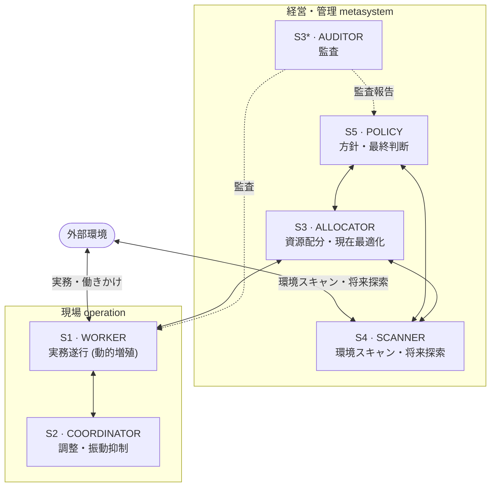
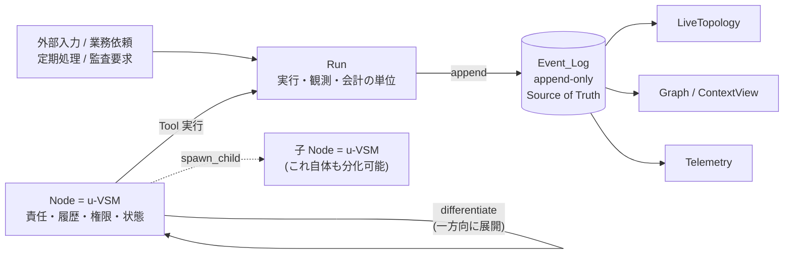

# Nanihold OS

**Viable System Model (VSM) runtime platform — LLM エージェントが運営する「AI 自動会社」のランタイム。**

## これは何か

Nanihold OS は、**組織を AI エージェント群で自律運営する**ための実行基盤(PoC)です。

土台にあるのは Stafford Beer の **VSM (Viable System Model)** — 生命体が環境変化のなかで存続し
続けるのと同じ構造を、組織に当てはめた管理サイバネティクスのモデルです。VSM では、どんな
「存続可能な組織」も次の役割に分解できるとされます。

| System | 役割 | このソフトでの担当 |
|---|---|---|
| **S1** WORKER | 実務を遂行する現場 | LLM エージェント(動的に増殖) |
| **S2** COORDINATOR | 現場どうしの衝突・振動を抑える調整 | LLM エージェント |
| **S3** ALLOCATOR | いまある資源を配分し最適化する | LLM エージェント |
| **S3\*** AUDITOR | 現場を直接監査する | LLM エージェント |
| **S4** SCANNER | 外部環境を観測し将来に備える | LLM エージェント |
| **S5** POLICY | 方針を決め最終判断を下す | LLM エージェント |

Nanihold OS は、この S1〜S5 + S3\* の各 System を **LLM ベースの Sub_Agent** として実装し、
VSM の標準チャネル経由でメッセージを交換させることで、タスクを組織的に処理します。Python
3.11+ / asyncio による単一プロセス実装で、すべてのやり取りは Run ごとの `events.jsonl`
(Event_Log)に追記され、後から完全にリプレイできます。

現行の `vsm` CLI はタスク投入・追加指示・状態確認・イベント追跡・リプレイに加え、`vsm selfdev`
で自己開発 Proposal の作成・承認・介入・merge outcome 記録を提供します。自己開発 CLI は常に
loopback REST API を経由し、Event Log へ直接 fallback しません。
実行中 Run には `vsm instruct <run_id> "<指示>" [--node <id>]` で外部エージェントからも
指示できます。最近の Run は `vsm runs` で一覧できます。

Selfdev の implementation Run は、ProposalManifest の `active_wall_clock_seconds` と
`[selfdev].implementation_timeout_margin_seconds` から全体制限時間を導出します。Agent backend の
単発 `timeout_seconds` にも同じ導出値を上限として渡し、既定値が短い backend timer で意図せず切断されないようにします。backend timeout を設定で明示的に短くした場合は設定を優先し、その理由を timeout reason に記録します。タイムアウト後もworkspaceの `candidate.patch`
と実行効果ログを成果物として保持します。cleanup は `runs/selfdev` に登録された worktree だけを対象にし、未知 path は warning event を記録して skip します。cleanup failure は対象 Proposal の SUSPEND + algedonic に封じ込め、controller 全体を停止させません。

### VSM システム構成

VSM は一方向のパイプラインではありません。**長期稼働を前提とし、外界との相互作用からタスクを
生成し、解決し、その成果を環境へ返す——というループを回し続けることで存続**します。外部環境
とのやり取りは **S1(担当業務の現場環境と直接やり取り)** と **S4(より広い環境と将来を観測)**
の二経路で行われ、各 System は VSM の標準チャネルで継続的に交信します。固定された処理順序は
持ちません。



> 環境からの入力でタスクが生まれ、VSM が処理・解決し、成果が環境へ戻る。この往復(生存ループ)を
> 回し続けることが「存続」であり、これが VSM の目的です。
> (現行の `vsm` CLI は検証用に S4→S5→S3→S1→S3\* の固定フローを使いますが、これは暫定実装で、
> 本来のランタイムは固定経路を持ちません。)

### ランタイムの考え方(Run / Event_Log / Node)

一般的なジョブ実行系と違い、Nanihold OS では **VSM 自体が長期稼働する前提**です。

- **Run** は Platform の起動停止ではなく、外部入力・業務依頼・定期処理・監査要求などに対応する
  「実行・観測・会計の単位」。
- **Event_Log** は append-only の唯一の真実(Source of Truth)。LiveTopology や Graph、各種
  ビューはすべて Event_Log から再生成される projection。
- **永続的な責任・履歴・権限・状態は Node が保持**し、Agent は Execution ごとに生成される
  一時的な実行主体。
- すべての Node は spawn 時に **`COLLAPSED` 状態の u-VSM** として生まれる。分化を選択した主体
  Agent はその u-VSM の **S5 として残り続け**、`differentiate` で親の権限
  (`ParentAuthority.may_differentiate_to`)の範囲内で S1〜S4 を実体化していく。まだ実体化して
  いない System の責任は S5 Agent が兼ねる。
- 分化は **`COLLAPSED` → `S5_ONLY` → `PARTIAL` → `FULL` の一方向**で進み、一度分化した u-VSM が
  未分化へ戻ることはない。こうして実体化した各 System(子 Node)も、それ自体が u-VSM として
  再帰的に分化できる。



### 構成の概略

実装は **Architecture / Role / Agent / Tool / Node** の層に分離されています。

| 層 | 役割 | パッケージ |
|---|---|---|
| Architecture | VSM の骨格(System・Channel・Event_Log・再帰構造)。LLM を知らない | `vsm.architecture`, `vsm.messaging`, `vsm.eventlog` |
| Role | Node の VSM 上の位置に紐づく責任契約 | `vsm.roles` |
| Agent | Role を一時的に実行する主体(LLM / Codex / 人間を同一抽象で扱う) | `vsm.agents` |
| Tool | 具体的な手続き。`ToolEffect` で副作用境界を型付けし、外部書込/制御は冪等キー必須 | `vsm.tools` |
| Node | 責任・履歴・権限・状態を保持する永続単位。`ParentAuthority` で権限委譲 | `vsm.nodes`, `vsm.authority` |

設計の全体像は [docs/architecture.md](docs/architecture.md)、実装の到達状況は
[docs/implementation-status.md](docs/implementation-status.md) を参照してください。

## クイックスタート

標準の開発環境は **WSL2 + Docker Compose** です。まず `app` サービスを起動します。

```bash
docker compose up -d app
```

Web ダッシュボードは API と Vite の2プロセスで起動します。別々のターミナルで次を実行し、
`http://127.0.0.1:5173` を開いてください。

```bash
# Terminal 1: FastAPI (127.0.0.1:8000)
docker compose exec app uvicorn vsm.web.app:app --host 127.0.0.1 --port 8000 --workers 1

# Terminal 2: React/Vite
cd frontend
npm run dev -- --host 127.0.0.1
```

Codex アプリの PowerShell からは、環境確認・起動・テストを同梱ラッパーへ統一します。

```powershell
powershell -NoProfile -ExecutionPolicy Bypass -File .\scripts\codex-dev.ps1 doctor
powershell -NoProfile -ExecutionPolicy Bypass -File .\scripts\codex-dev.ps1 up
powershell -NoProfile -ExecutionPolicy Bypass -File .\scripts\codex-dev.ps1 test -q
```

Run 作成 API は JSON の `goal`、`constraints`、任意の `budget` 上書きを受けます。API は
ローカル利用専用で認証を持たないため、uvicorn は必ず `127.0.0.1` に bind してください。

Web の「自己開発」タブでは Proposal の一覧、`NEEDS_HUMAN` 応答、状態 rail、合議全文、Gate /
Audit / 予算、artifact、`MERGE_READY` PR説明文コピーを扱えます。push、PR作成、merge は人間の
明示操作へ残しています。

詳しい手順、LLM プロバイダ設定、CLI の使い方は下記ドキュメントを参照。

## ドキュメント

ドキュメントは [docs/](docs/README.md) に整理している。

**使い方**

- [docs/setup.md](docs/setup.md) — 環境構築(WSL / Docker、Windows ネイティブ、Codex アプリ、LLM プロバイダ設定)
- [docs/cli.md](docs/cli.md) — `vsm` CLI コマンド、Run の確認、終了コード、開発コマンド、ファイルレイアウト
- [docs/web-ui.md](docs/web-ui.md) — ローカル Web UI ダッシュボード
- [docs/economics.md](docs/economics.md) — 円建て economic ledger / survival report / 事業状況 API
- [docs/discord-bot.md](docs/discord-bot.md) — Discord Codex Bot

**設計・計画**

- [docs/architecture.md](docs/architecture.md) — VSM ランタイムの設計リファレンス
- [docs/implementation-status.md](docs/implementation-status.md) — 実装到達状況とスコープ
- [docs/roadmap.md](docs/roadmap.md) — 製品化までのロードマップ

エージェント(Codex / Claude Code 等)向けの開発規約は [AGENTS.md](AGENTS.md)。過去の作業文書・
廃止済みスペックは [docs/archive/](docs/archive/README.md) に保管している。

## ライセンス

Proprietary. 本 PoC のライセンスは未確定。
