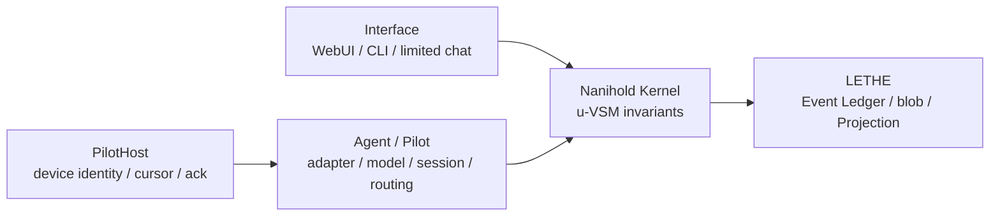

# Nanihold OS architecture

## 1. 最上位要件

ユーザーが同じ相手との長期的な会話として仕事を操縦でき、短い訂正、離席・再開、複数の仕事、停止、完了確認を追加説明なしに扱えることを最上位要件とします。token、費用、latency はこの UX を壊さない範囲で最適化します。

永続主体は personal DataSpace に属するユーザー所有 Interface Node と canonical Conversation です。接続する Interface Pilot は交換可能で、人格名や provider のモデル固有名を Kernel、Node、Conversation の識別子へ含めません。現在の Claude Adapter は provider 側のモデル設定を使用し、Interface 用 effort を `high` に固定します。

## 2. 層と依存方向

Kernel は provider の CLI flag、permission classifier、WebUI 表示型を知りません。Claude 固有機能は Claude Pilot Adapter の mode に、表示は Interface に隔離します。LETHE は唯一の運用正本です。

Interface turn の実provider境界は、Kernel process内のCLI起動ではなく、認証された外部PilotHost RPCです。PilotHostはexact ModelCandidateをhealth応答で宣言し、turnごとにrequested candidate keyとactual provider/modelを返します。Naniholdは不一致の応答を保存・採用しません。

## 3. 永続モデル

### DataSpace

個人、会社、sandbox は別 DataSpace です。SQLite は別ファイル、PostgreSQL は専用 schema と role を使います。実行中の二重書きと backend fallback は禁止です。

個人と会社の横断参照は期限、用途、対象を持つ ReferenceGrant だけです。個人の生会話を company Lake へ複製しません。

### UVSMNode

Node Tree は永続します。各 Node は外部から S1 として見え、内部には resident S1、S2、S3、S3*、S4、S5 を持ちます。Interface Node は company Node の子にはせず、CapabilityGrant で会社 u-VSM に参加します。S5 の配下に resident S3 を持つため、方針と現在運用を同じ主体の中でつなげられます。

### WorkItem と Execution

WorkItem は約束と仕事を保持し、Execution は一時的な Pilot の試行です。同じ Node と WorkItem に複数 Execution を持てますが、一つの Execution は一つの Pilot だけです。

dispatch時のExecutionには、設定された`Agent_name.csv`からモデル階級とプロバイダ系統に
対応する個名をタスク単位で割り当てます。いいね=0の行と予約席`Nagi`は自動候補から除外し、
同一プールの枯渇時だけ数字サフィックスを付与します。割当は`agent_name_assigned` Eventとして
Ledgerへ記録し、Executionと後続のPilot receipt EventからWorkItem・Node・Pilotとの帰属を復元できます。
`Nagi`は`node:owner-interface`に属するS5常設席であり、このローテーションには参加しません。

返信 authoring はこの個名を WorkItem handoff まで保持し、エージェントが明示的に
`reply-draft@1` を incoming Observation に anchor して LETHE card-queue へ投入する。
draft の envelope は `created_by` と `lineage` に個名、WorkItem ID、Execution ID を
記録する。エージェントは承認や送信を実行せず、オーナー承認の
`reply-approval@1` のみが既存 `lethe-channel-bridge` を起動し、bridge が draft を
anchor した `send-record@1` を作る。これにより返信の authoring から配信結果までを
個名付きで監査できる。

Work Graph edge:

- `DELEGATED_TO`: 親から子への委任
- `INTEGRATED_BY`: 子から統合責任を持つ親への逆参照
- `DEPENDS_ON`: 実行順の依存

Pilot が終了しても Node、WorkItem、約束、会話、記憶は残ります。

### Event と Projection

すべての状態変更は Event Ledger へ optimistic version と idempotency key 付きで append してからメモリ view を変更します。長文、owner message、生ログは content-addressed blob です。Projection は cursor 順序と stream version の連続性を検証し、Kernel、Interface、routing posterior、Token Lab を再構築します。

## 実行環境の契約と実体

実行環境は、必要な能力を機械非依存に宣言する EnvironmentContract と、契約を具体的な実行場所へ束縛する EnvironmentInstance に分離します。EnvironmentInstance は論理パス名から物理パスへの写像、CLI 実体パス、`CODEX_HOME`、実体メタデータを持ちます。契約の `environment_fingerprint` は契約だけから決まり、これらの実体情報や `instance_fingerprint` は candidate identity に含めません。

EnvironmentInstance の `candidate → verified → active → retired` 遷移は、既存の EventEnvelope / Operational Ledger の stream version / idempotency key パターンで記録します。`PreflightGate` は正式な EnvironmentContract から検証タプルの fingerprint を計算し、`EnvironmentInstanceService.preflight_evidence_hook()` が合格証拠の契約・instance fingerprint を照合して `environment_instance_verified` Eventへ保存します。稼働中の実体が壊れたときは、同じ契約 fingerprint の verified 実体へ切り替え、契約 fingerprint を変えません。適合実体が無い場合は再プロビジョニング要求イベントを残して注入フックへ渡します。いずれも個別実体について owner 承認を要求せず、実際の発見・構築・preflight 実行はこのライフサイクル境界の外側で行います。

同じDataSpace LedgerにはLETHE所有の`history.message_imported`と
`history.import_completed`も存在します。この2種だけはLETHE Adapterが外部履歴Eventとして
明示分類し、Nanihold内部IDへ混入させずcursorを通過させます。History Projectionの正本は
LETHEにあり、Naniholdの業務Projectionへは写しません。予約streamとの不一致や、それ以外の
未知event typeはfail-fastします。

### Activation と履歴

Interface Node の起動状態は
`UNCOMMISSIONED → HISTORY_IMPORTED → REORIENTATION_ONLY → AWAITING_OWNER_CONFIRMATION → ACTIVE`
を基本経路とします。`AWAITING_OWNER_CONFIRMATION`のAssessmentに不備がある場合だけ、
ownerの理由コード付きrevisionにより`REORIENTATION_ONLY`へ戻せます。以前のAssessmentは
上書きせずEventとして残し、provider session checkpointとusageを保持します。
revision pendingと実行中attemptは別にProjectionし、attempt中の二重startを拒否します。
runtime restartでbackground attemptが失われた場合もsilent resetせず、固定理由コードの
interruption Eventを記録してfailure retry経路へ移します。
全必須sourceのmanifest、ownership、件数、digest、cutover cursorが
`HistoryImportReceipt`と一致するまで履歴取込を受理しません。owner確認前はKernel自身が
Execution、dispatch、Effect planning／approval／activationを拒否します。

再オリエンテーションは通常会話と分離した履歴照会loopです。Interface Pilotへ全履歴をprompt注入せず、
型付き`HistoryReader`でLETHEの索引を照会します。Naniholdによる全blob走査や検索fallbackは
ありません。LETHEが返したsize制限内の`result_json`と同じcanonical bytesをblob保存し、
digestとcursorを監査します。上限超過は暗黙truncateせず、明示page cursorを要求します。

同じ Event Ledger をLETHEとNaniholdが共有するcursor付き全page読取では、走査の途中に
Naniholdの監査Eventをappendしません。最初のpageから終端cursorまでを安定して完全走査し、
receiptとの集合・件数照合を完了してから、取得した各pageを参照する監査証拠をappendします。
これにより自身のappendが読取対象を動かすことを防ぎます。途中pageへのfallback、互換reader、
暗黙の再試行経路はありません。

Assessmentは全sessionのcoverage、open commitment、存在するWorkItem、履歴読取後の現況照会、
claimごとのmessage/Event citationを決定論的に検証します。ownerの訂正は過去を変更せず
新しいDecision Eventになります。実在する未完WorkItemがあるのにresume対象が空のAssessmentは
ownerへ提示せず、理由をEventへ残して再評価します。

初回turnだけは完全なAssessment契約を渡します。provider responseを受信した直後に
provider session checkpointをEventへ確定し、後続gateが失敗しても同じroot sessionを
継続します。resume turnへ渡すのはcontract digest、session index ref/count、
open commitment ID、実在WorkItemのID・title・description・acceptance・state、
最小history cursorからなるcompact referenceとevent deltaだけです。全session ID、
履歴本文、完全な契約を再送しません。

## 4. 制御不変条件

- LETHE append が失敗した Effect は開始しない。
- Effect 結果が不明なら `UNKNOWN` とし、同じ Effect idempotency key で照合する。
- 人間介入は対象 WorkItem、その active Execution、その Effect Lease だけを止める。
- severe S3* finding は同階層 S5 の明示承認まで WorkItem を block する。
- PilotHost 切断時、接続先の active Execution は `PAUSED` になる。
- exact selectionのrequested provider/model と actual provider/model が違う応答は採用しない。
  `provider_configured`のInterface Pilotは固有modelを要求せず、providerが報告した
  actual modelを各receiptの証拠として保存する。
- production route は現在の verified evidence cursor と一致する公開済み RouteSnapshot だけ。
- dependencyが完了したREADY WorkItemだけをdispatcherが選び、公開済みRouteSnapshotから
  exact ModelCandidateを決める。独立WorkItemは同一batchで並列に要求できる。
- AI Judge の証拠だけで高リスク production route へ昇格しない。

## 5. Interface UX と token

owner message は Pilot 呼出し前に personal Lake の blob と Event へ保存します。通常応答は一回の Interface Pilot 呼出しから表示文と型付き`InterfaceAction`を取得し、WorkItem、dependency、委任、decision、commitment、Effect計画へmaterializeします。

長いInterface／Reorientation payloadはcontent-addressed documentへ原子的に保存します。
CLIのstdinに渡すのはdocument digestを含む256 bytes以下の一時的な短い指示だけです。
stdout/stderrも監査対象のprovider I/O documentへcaptureし、terminalへ長文を連続入力・
表示する経路を運用interfaceにしません。これはPCの描画負荷を抑えるだけでなく、
どの情報をいつPilotへ渡したかをreceiptから追跡できるためのUX要件です。

canonical `Conversation`とsurface別`SurfaceBinding`、provider別`PilotSession`は分離します。
transport不明時は`action_id`で同じ`ConversationActionReceipt`を照合でき、messageを再送しません。

status、keepalive、quota 表示、Event tail、routing score は Projection と決定論的ロジックで返し、モデルを呼びません。継続中は provider resume と Event delta を使います。Dispatcher は runtime が Projection rebuild を完了した cursor を必須入力として受け、その cursor より後だけを最初のdeltaにします。以後は送信済みのthrough cursorを排他的に前進させるため、並行dispatchでも過去Ledger・全履歴・同じdeltaを再送しません。Pilot 交代時は Node memory、未完 WorkItem、未解決 commitment、直近 Event delta だけから resume pack を作り、全 transcript は送信しません。

`deployment.mode=local_verification` はproduction routingから隔離された検証面です。そこでは検証用の安価なexact candidate allowlist、`low`、`observe_only`、tools disabled、classifier disabledだけを許し、allowlist外candidateとwrite Effectを構成validationで拒否します。暫定的なモデル名を禁止語として判定しません。productionのInterface Pilotは`model_selection=provider_configured`と`effort=high`を使用します。

Claude root sessionのcache warmingは固定timerを持ちません。同一candidate、cwd、MCP prefix、
quota floor、queued owner turnなし、posterior confidence 95%以上を確認し、
`P(next use) × (cold cost − cache-hit cost) > warming cost`のときだけrootをresumeしてforkします。
自動Opus切替はAdapter環境で無効化します。

## 6. グランドデザインから採用した原則

古い設計資料から次を採用しています。

- 持続する Node 記憶と交換可能な処理モデルの分離
- 可逆な委任
- 人間が任意階層へ参加できる制御
- 時間的 u-VSM と Event への drill-down
- 生データまでたどれる監査

FSX は Kernel metric や自動目的関数にはせず、主体性、監査可能性、強制への抵抗を評価する設計原則として扱います。

## 7. LETHE current-state query

`get_current_state`を無引数で呼ぶと、key、根拠Event、時刻、本文byte数、digestだけの
cursor付き索引を返します。Interface Pilotが本文を必要と判断した場合だけ、
`state_key`を明示した別queryで1件を取得します。Naniholdは全件本文を暗黙に取得せず、
旧形式の全文化された応答へfallbackしません。
