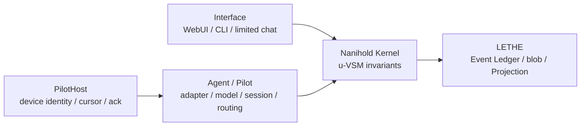

# Nanihold OS architecture

## 1. 最上位要件

ユーザーが同じ相手との長期的な会話として仕事を操縦でき、短い訂正、離席・再開、複数の仕事、停止、完了確認を追加説明なしに扱えることを最上位要件とします。token、費用、latency はこの UX を壊さない範囲で最適化します。

Fable は永続人格ではなく Claude Adapter が提供する現在の Interface Pilot です。永続主体は personal DataSpace に属するユーザー所有 Interface Node です。

## 2. 層と依存方向

Kernel は provider の CLI flag、permission classifier、WebUI 表示型を知りません。Claude 固有機能は Claude Pilot Adapter の mode に、表示は Interface に隔離します。LETHE は唯一の運用正本です。

Interface turn の実provider境界は、Kernel process内のCLI起動ではなく、認証された外部PilotHost RPCです。PilotHostはexact ModelCandidateをhealth応答で宣言し、turnごとにrequested candidate keyとactual provider/modelを返します。Naniholdは不一致の応答を保存・採用しません。

## 3. 永続モデル

### DataSpace

個人、会社、sandbox は別 DataSpace です。SQLite は別ファイル、PostgreSQL は専用 schema と role を使います。実行中の二重書きと backend fallback は禁止です。

個人と会社の横断参照は期限、用途、対象を持つ ReferenceGrant だけです。個人の生会話を company Lake へ複製しません。

### UVSMNode

Node Tree は永続します。各 Node は外部から S1 として見え、内部には resident S1、S2、S3、S3*、S4、S5 を持ちます。Interface Node は company Node の子にはせず、CapabilityGrant で会社 u-VSM に参加します。S5 の配下に resident S3 を持つため、方針と現在運用を同じ主体の中でつなげられます。

### WorkItem と Execution

WorkItem は約束と仕事を保持し、Execution は一時的な Pilot の試行です。同じ Node と WorkItem に複数 Execution を持てますが、一つの Execution は一つの Pilot だけです。

Work Graph edge:

- `DELEGATED_TO`: 親から子への委任
- `INTEGRATED_BY`: 子から統合責任を持つ親への逆参照
- `DEPENDS_ON`: 実行順の依存

Pilot が終了しても Node、WorkItem、約束、会話、記憶は残ります。

### Event と Projection

すべての状態変更は Event Ledger へ optimistic version と idempotency key 付きで append してからメモリ view を変更します。長文、owner message、生ログは content-addressed blob です。Projection は cursor 順序と stream version の連続性を検証し、Kernel、Interface、routing posterior、Token Lab を再構築します。

## 4. 制御不変条件

- LETHE append が失敗した Effect は開始しない。
- Effect 結果が不明なら `UNKNOWN` とし、同じ Effect idempotency key で照合する。
- 人間介入は対象 WorkItem、その active Execution、その Effect Lease だけを止める。
- severe S3* finding は同階層 S5 の明示承認まで WorkItem を block する。
- PilotHost 切断時、接続先の active Execution は `PAUSED` になる。
- requested provider/model と actual provider/model が違う応答は採用しない。
- production route は現在の verified evidence cursor と一致する公開済み RouteSnapshot だけ。
- AI Judge の証拠だけで高リスク production route へ昇格しない。

## 5. Fable UX と token

owner message は Pilot 呼出し前に personal Lake の blob と Event へ保存します。通常応答は一回の Interface Pilot 呼出しから表示文、Work directive、decision、commitment update を取得します。

status、keepalive、quota 表示、Event tail、routing score は Projection と決定論的ロジックで返し、モデルを呼びません。継続中は provider resume と Event delta を使います。Pilot 交代時は Node memory、未完 WorkItem、未解決 commitment、直近 Event delta だけから resume pack を作り、全 transcript は送信しません。

`deployment.mode=local_verification` はproduction routingから隔離された検証面です。そこでは安価なmodelの`low`、`observe_only`、tools disabled、classifier disabledだけを許し、Fable/Opusとwrite Effectを構成validationで拒否します。production既定の`claude-fable-5 / high`は変更しません。

## 6. グランドデザインから採用した原則

古い設計資料から次を採用しています。

- 持続する Node 記憶と交換可能な処理モデルの分離
- 可逆な委任
- 人間が任意階層へ参加できる制御
- 時間的 u-VSM と Event への drill-down
- 生データまでたどれる監査

FSX は Kernel metric や自動目的関数にはせず、主体性、監査可能性、強制への抵抗を評価する設計原則として扱います。
